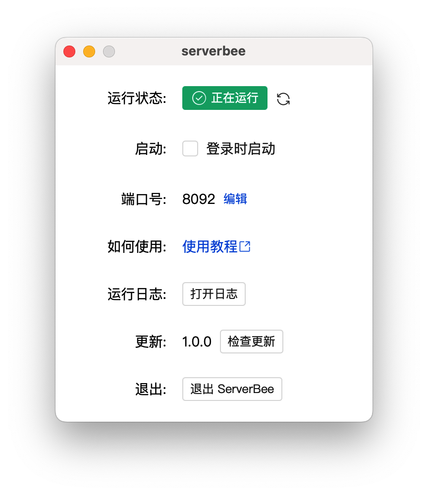

Language : 🇺🇸 English | [🇨🇳 简体中文](./README.zh-CN.md)

<h1 align="center">serverbee-desktop</h1>

<div align="center">

A desktop wrapper for [server_bee-backend](https://github.com/ZingerLittleBee/server_bee-backend)

Backend for iOS application named [ServerBee](https://apps.apple.com/us/app/serverbee/id6443553714)


</div>

## Snapshot



## How to compile

### Prerequisites

[Please refer to the tauri guide](https://tauri.app/v1/guides/getting-started/prerequisites/)

### Quick Start

```bash
$ git clone https://github.com/ZingerLittleBee/serverbee-desktop.git
$ cd serverbee-desktop
$ pnpm i
$ pnpm tauri build
```

and then, find release in `src-tauri/target/release/bundle`

## Found an issue or have a proposal

[Create an issue](https://github.com/ZingerLittleBee/serverbee-desktop/issues)

## Release Notes

SEE [CHANGELOG](./CHANGELOG.md)
